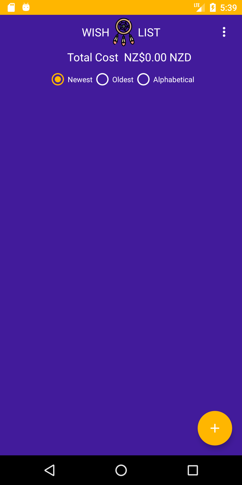
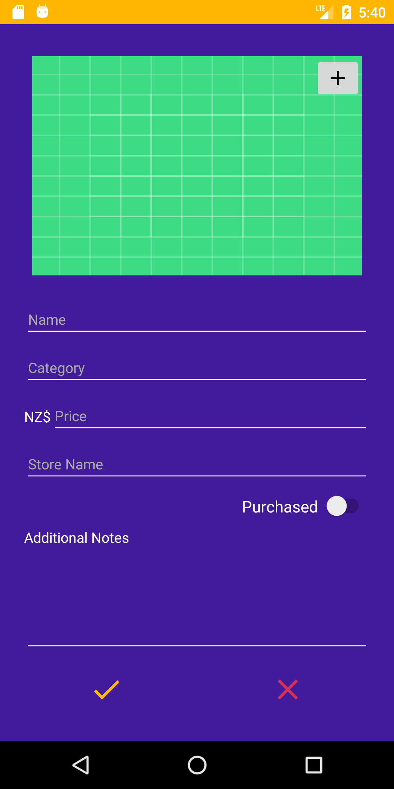
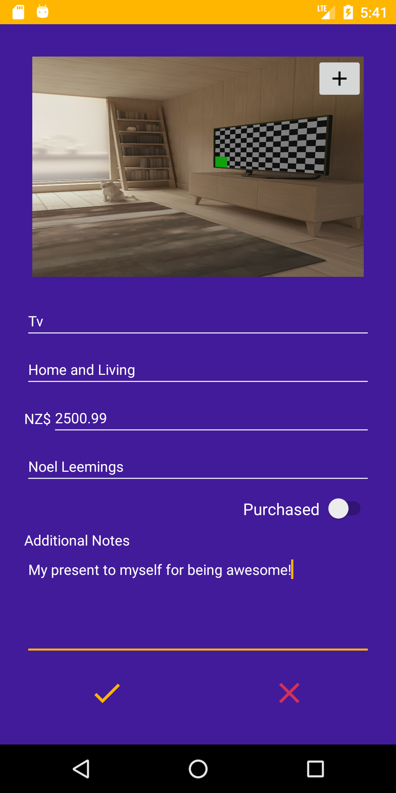
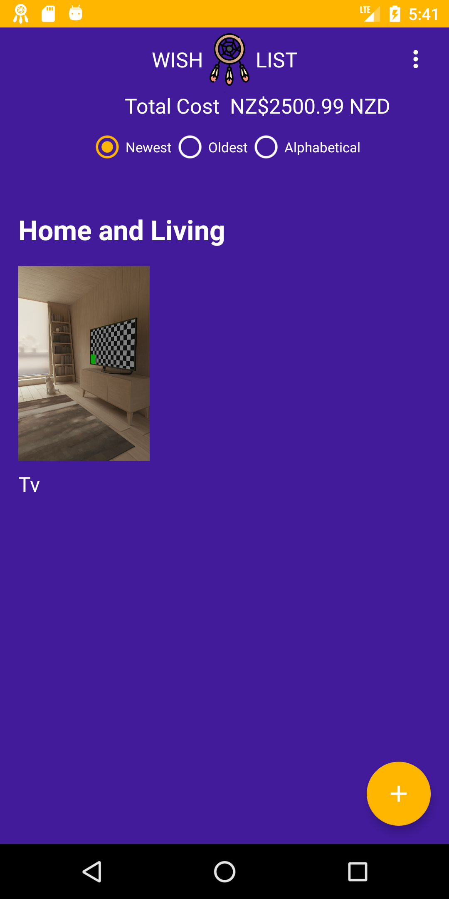
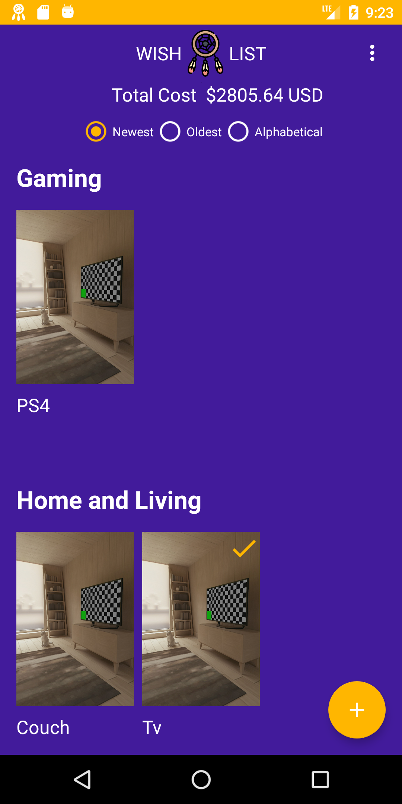

# Wish List User Guide

|Description |	Screenshot |
|------|------|
| |On first start up you will find yourself here. This is the main page of the application. Things to note are:     - Three dots in the top right is a drop down list that contains various options     - Total Cost refers is the current total cost of all items in your wish list     - Below total cost are the sorting filters for the items in your wish list     - The circle with a plus in it at the bottom is used to add new items to the wish list|
| |This is the wishlist item adding screen. You must fill in each of the fields except the additional notes and the purchased slider which are optional. Pressing the '+' button in the corner of the image box will open your devices camera so you can take a photo of your item|
| |This is an example of a completed wishlist item Pressing the yellow tick to add your item to your wish list. Pressing the red 'x' will discard.|
| |After adding or discarding an item you will be returned to the main screen. There is now a item inside your wishlist.  The title 'Home and Living' is the category that the item belongs to. Adding addition items to this category will result in them being placed alongside this item. Adding a new item from a different category will create another sublist with that item inside it. Notice that the wishlist total has also been updated to display the new wishlist total.|
| |Clicking on an item in your wishlist will open this screen. This is the items product details page. Here you can choose to edit the item by pressing the pencil button below the items image, examples of why this could be useful are updating the price or marking the item as purchased. Pressing the edit button takes you back to same screen as adding an item, except all the fields are filled in with the items current values. The option to delete the item from the wishlist is found here, this is achieved by pressing the trash can button on the top right.|
| |Heading back to main screen, an additional item has been added to wishlist. A few things to note:     - The total cost of the wishlist has been updated to reflect this.     - There is a yellow check mark on the Tv item now, this means that item has been marked as purchased.     - The new item, Couch, is inside the same list as Tv, this is because they both have the same category Home and Living. Currently the items are sorted newest to oldest. Thats why the Couch is displayed before Tv despite being added after it.|
| |Now the items are sorted oldest to newest. Notice that the sorting filters at the top have been updated to reflect this. Using the third filter alphabetical is self explanitory, items will be arranged alphabetically.|
| |This is an example of a new sub-list being added when an item from a new category is added.|
| |Pressing the three dots in the top right corner expands the options menu:     - Exit first prompts the user asking if they are sure and on confirmation, closes the application.     - Privacy Policy displays the applications privacy policy.     - Settings opens the settings menu.|
| |This is the settings menu. It can be dismissed by simpling tapping anywhere outside the settings area. Settings are updated as soon as they are changed, there is no need for a confirmation button. Currency unit changes the monetary amount that is displayed in the wishlists total amount and on the product details screen. *WARNING* When adding an item the price added in that items currency. Notifications toggles on/off whether the application will send your device a notfication as to the number of items unpurchased in your cart.|
